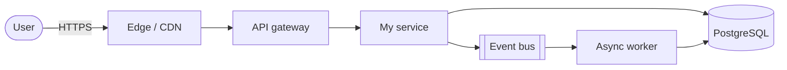
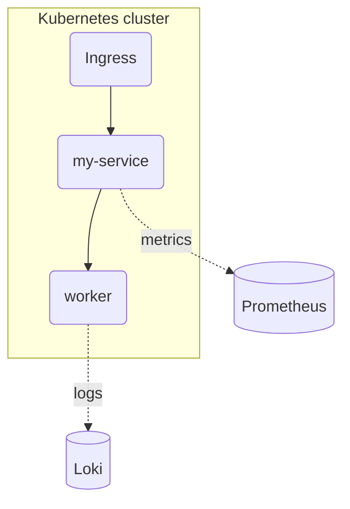

# Architecture overview

A high-level look at the system. Diagrams below are rendered with
**Mermaid** in the browser, courtesy of `mkdocs-mermaid2-plugin`.

# Components

```mermaid
flowchart LR
    user([User]) -->|HTTPS| edge[Edge / CDN]
    edge --> api[API gateway]
    api --> svc[My service]
    svc --> db[(PostgreSQL)]
    svc --> queue[[Event bus]]
    queue --> worker[Async worker]
    worker --> db
```

# Deployment

```mermaid
graph TB
    subgraph k8s[Kubernetes cluster]
        direction TB
        ingress(Ingress) --> svcA(my-service)
        svcA --> svcB(worker)
    end
    svcA -. metrics .-> prom[(Prometheus)]
    svcB -. logs .-> loki[(Loki)]
```
