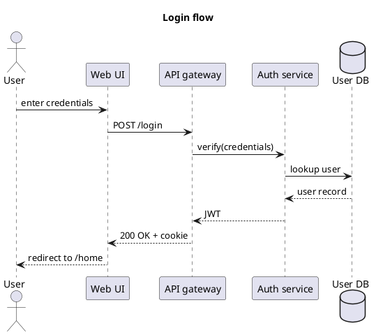
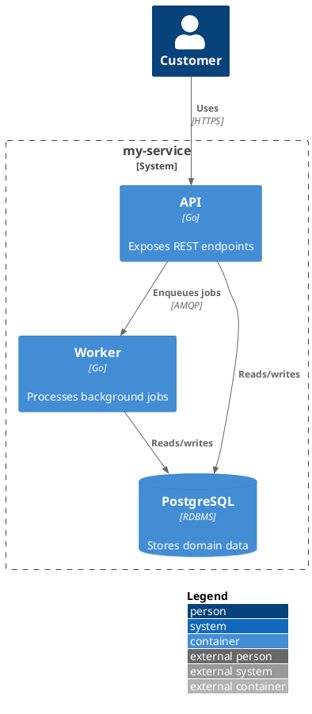

# Sequence diagrams

These are rendered server-side by **PlantUML** (`plantuml_markdown`
extension). The portal image ships a local `plantuml` binary so no
external server is required.

## Login flow

## C4 container view

You can also use the `::uml:: ... ::end-uml::` block syntax — both are
supported by `plantuml-markdown`.
